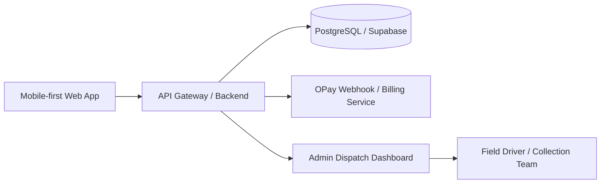

# Klinam: Decentralized Waste-Management-as-a-Service (WaaS) Utility Platform

## 1. Executive Summary

Klinam is a decentralized waste-management utility platform designed for Nigerian university off-campus residential zones where conventional municipal compactor trucks cannot reliably operate. The platform combines a low-cost digital operations layer, recurring subscription economics, circular-economy monetization, and a lightweight field workflow tailored for narrow, unpaved, and rugged access roads.

The core thesis is simple: replace heavy hardware dependence with a user-triggered, mobile-first operations model that is affordable, resilient, and easy to deploy. Landlords and caretakers report bin fullness through a single dashboard action, and the internal operations team uses that signal to dispatch agile utility vehicles and coordinate collection routes.

The result is a service that is operationally viable, financially sustainable, and modular enough to scale from a single residential cluster to a citywide network.

---

## 2. Product Vision and Mission

### Vision
To create a self-sustaining, decentralized waste utility network that turns residential waste accumulation into a coordinated serviceable infrastructure layer for university-adjacent communities.

### Mission
To provide reliable, low-friction, community-based waste collection for underserved neighborhoods using a digital-first utility model that minimizes CapEx, supports circular-economy monetization, and improves public sanitation outcomes.

### Problem Statement
Traditional municipal waste systems are often too expensive, too rigid, and too hardware-intensive for dense, informal, or hard-to-access residential zones. The result is waste overflow, sanitation risk, and poor service responsiveness.

Klinam addresses this by building a software-led utility experience around three pillars:
- Predictable recurring revenue
- Lean, operator-friendly logistics
- Circular-economy material recovery

---

## 3. Module 1: Comprehensive Revenue Generation Engine

### 3.1 Revenue Model Overview

Klinam is designed as a multi-stream circular-economy utility platform with both inbound and outbound monetization channels.

#### Inbound Revenue Streams
1. B2C Landlord Monthly Subscription Fees
   - Landlords or property managers pay a recurring monthly utility fee for waste collection services.
   - Fees are structured as a sustainable maintenance utility subscription rather than a one-off service charge.
   - This creates a predictable cash-flow base for operating expenses, route planning, and fleet coordination.

2. B2B Collection Contracts
   - The platform may extend service to hostels, apartment complexes, retail clusters, and nearby campus-adjacent businesses.
   - Commercial contracts can be priced by volume, service frequency, or collection tier.

#### Outbound Revenue Streams
1. Recyclable Material Sales
   - Collected plastics are sorted at central optimization hubs.
   - Clean HDPE and PET streams are sold to manufacturing recyclers.
   - Revenue is tied to market pricing, sorting yield, and material quality.

2. Organic Waste Monetization
   - Organic material is routed to local biogas plants or compost processing facilities.
   - This creates a second circular-economy channel and offsets processing costs.

3. Value-Added Service Upsells
   - Premium service tiers for higher-frequency pickups
   - Bulk waste handling for events or seasonal periods
   - Optional sanitation support services

### 3.2 Financial Architecture Principles

The platform follows a circular-economy utility financial design:
- Service revenue creates cash-flow stability.
- Material recovery creates margin improvement.
- Operational efficiency reduces cost-per-collection.
- Software automation reduces administrative overhead.

### 3.3 Revenue Flow Logic

The financial engine should operate in three layers:
1. Subscription Layer
   - Monthly charges captured via OPay recurring billing.
   - Revenue recognized per active property on the ledger.

2. Operations Layer
   - Each completed collection is logged as a service event.
   - Route cost, labor cost, and truck usage are attributed to properties serviced.

3. Recovery Layer
   - Recyclable recoveries and organics diversion are recorded as secondary revenue or cost offsets.

### 3.4 Predictability and Sustainability Strategy

To improve financial predictability:
- Use fixed monthly subscription tiers for residential properties.
- Maintain active service statuses for properties that have consented to recurring debit.
- Introduce dynamic pricing only after enough route-level operating data has been collected.
- Track per-property profitability over time using a cost-to-revenue ratio model.

### 3.5 Example Commercial Structure

A typical recurring service bundle may include:
- Weekly or bi-weekly collection
- Waste drum servicing and basic sanitation support
- Priority dispatch for overflow conditions
- Access to the caretaker dashboard and service history

This creates a practical “utility as a service” offering rather than a transactional waste pickup business.

---

## 4. Module 2: Fintech Integration and Disbursement Architecture

### 4.1 OPay Merchant Payment Gateway Integration

Klinam should use the OPay Merchant Payment Gateway API ecosystem to remove cash friction and automate recurring ledger management.

#### Primary Fintech Capabilities
- Recurring monthly billing for landlords and property caretakers
- Secure payment status tracking
- Instant transaction visibility in user profiles
- Automated reconciliation of failed, successful, and pending debits

### 4.2 Recurring Billing Flow

#### Onboarding
1. A landlord or caretaker creates an account.
2. They complete property onboarding and select a subscription plan.
3. They authorize OPay recurring debit consent.

#### Billing Mandate
- The OPay Recurring Billing API stores a debit mandate linked to the property account.
- On the first day of each month, OPay triggers a billing event.
- The backend validates the mandate, processes the debit, and updates the subscription status.

#### Webhook-driven Status Update
- The billing webhook is the authoritative signal for monthly status renewal.
- If the transaction succeeds, the property remains active and eligible for collection.
- If it fails, the property is marked inactive or suspended until payment is resolved.

### 4.3 Backend Logic for Monthly Activation

The system should implement a monthly state machine such as:
- Pending Authorization
- Active Subscription
- Billing Failed
- Suspended
- Reactivated

This state machine ensures that the property collection status is accurately reflected on the first day of each month.

### 4.4 Historical Ledger Architecture

Klinam should maintain a secure transaction ledger with the following minimum fields:
- User ID
- Property ID
- Subscription Plan ID
- OPay Reference ID
- Amount
- Currency
- Transaction Date
- Transaction State
- Payment Method
- Failure Reason (if any)

#### Ledger Retrieval Framework
The client profile should expose a payment history view with filtering criteria such as:
- Date range
- Amount range
- Transaction status
- OPay reference ID
- Subscription period

This creates operational transparency for landlords and internal finance teams.

### 4.5 Security and Compliance Considerations

The fintech layer must include:
- Tokenized API access
- Webhook signature verification
- Encrypted storage of payment references
- Audit logging for all financial state changes
- Idempotent reconciliation to prevent duplicate charges

---

## 5. Module 3: Hardware-Lean, User-Initiated Infrastructure

### 5.1 Design Philosophy

Klinam intentionally avoids expensive electronic sensors on street drums. The platform favors a human-readable, low-cost operational model that depends on accountable property caretakers rather than fragile hardware.

### 5.2 Core Interaction Model

The system is based on a single property status field:
- Default State: Empty
- Mutated State: Filled

#### User Workflow
1. A caretaker logs into a mobile-first web dashboard.
2. They review the property’s current collection state.
3. When the bin fills, they click “Report Bin as Full”.
4. The platform updates the property status from False to True.

### 5.3 State Change Pipeline

This interaction should trigger a reactive state mutation pipeline:
1. Frontend event fires on button press.
2. API call sends the updated property state.
3. Backend updates the database flag.
4. The system broadcasts the new state to the internal operations dashboard.

### 5.4 Why This Model Works

This design reduces:
- Hardware failure risk
- Maintenance costs
- Installation complexity
- Upfront capital expenditure

It also aligns with the realities of the operating environment, where maintenance teams may face unstable infrastructure conditions and limited equipment availability.

### 5.5 Operational Assumptions

The model assumes that:
- Caretakers are reachable and accountable
- Reporting can happen via mobile internet or intermittent connectivity
- Response times are acceptable when the system is used consistently

### 5.6 Optional Enhancements

If later needed, the platform can add lightweight enrichment features such as:
- Image upload confirmation
- GPS check-in from the caretaker device
- Escalation rules for repeated non-reporting

These features remain optional and should not be required at launch.

---

## 6. Module 4: Operations Feed and Centralized Admin Manifest

### 6.1 Internal Operations Dashboard

The internal management console is the control center for field operations. It should present a high-density view of all active properties and their current collection urgency.

### 6.2 Queue Prioritization Logic

The platform should prioritize properties using a simple status-driven queue:
- Filled properties appear at the top of the dispatch queue.
- Filled rows are visually highlighted with a strong red indicator.
- Empty properties remain in the default queue and are serviced based on plan or route efficiency.

### 6.3 Field Dispatch Workflow

For each flagged property, the operator should see:
- Property name or address
- Caretaker contact details
- Route directions
- Lodge marker or landmark reference
- Current status
- Collection history

### 6.4 Logistics Dispatching Model

Once a property is identified as urgent:
1. The operator reviews the row details.
2. The operator dispatches a small agile utility truck or collection vehicle suitable for rugged corridors.
3. The driver physically clears the site.
4. The operator updates the platform back to Empty.
5. The loop closes and the property becomes available for the next cycle.

### 6.5 Functional Requirements for the Admin Console

The admin manifest should support:
- Real-time property status updates
- Search and filtering by zone, property type, or caretaker
- Priority sorting by filled status
- Manual override for route changes
- Completion logging for each collection event
- Notes for recurring hotspots or repeat issues

### 6.6 Dispatch Intelligence Opportunities

As the system matures, the operations layer can evolve into a route optimization engine that uses:
- Historical urgency patterns
- Road accessibility constraints
- Driver capacity limits
- Time-of-day service frequency

At launch, however, manual dispatch remains the correct first version because it is operationally simpler and more reliable.

---

## 7. Module 5: Tech Stack Separation and Deployment Architecture

### 7.1 Architectural Principle

Klinam should be built as a clean three-tier software system with separation between presentation, application logic, and data storage.

### 7.2 Tier 1: Frontend Core

The frontend should be a mobile-first, responsive, lightweight web application built using:
- Semantic HTML5 markup
- CSS3 Grid and Flexbox for layout
- Vanilla JavaScript for dynamic DOM updates and state handling

#### Frontend Responsibilities
- User login and onboarding
- Property registration and subscription selection
- Bin full reporting action
- Payment history view
- Admin dashboard interaction

#### Frontend Design Principles
- Fast load time on low-end mobile devices
- Minimal dependency footprint
- Accessible interfaces for caretakers and operators
- Simple interactions suitable for low-bandwidth environments

### 7.3 Tier 2: Backend Engine

The backend should be implemented using either:
- Node.js with Express, or
- Python with FastAPI

#### Recommended Approach
A Node.js + Express backend is a pragmatic choice for a lean MVP if the team wants rapid API development and a large ecosystem of middleware. A Python + FastAPI stack is equally strong if the team prioritizes type safety and modern API validation.

#### Backend Responsibilities
- Authentication and authorization
- Subscription billing logic
- OPay webhook handling
- Property state mutation
- Dispatch event processing
- Ledger and transaction reconciliation
- REST API endpoints for the frontend and admin console

### 7.4 Tier 3: Relational Database

The system should use PostgreSQL via Supabase for its relational database capabilities and simple managed deployment experience.

#### Core Tables
1. Users
   - User ID
   - Name
   - Email/phone
   - Role
   - Account status

2. Properties
   - Property ID
   - Owner ID
   - Address
   - Landmark marker
   - Caretaker ID
   - Current fill flag
   - Subscription status

3. Subscription Logs
   - Subscription ID
   - Property ID
   - Plan type
   - Start date
   - End date
   - Billing status
   - Last payment reference

4. Fill Flags
   - Flag ID
   - Property ID
   - Is Filled
   - Reported at
   - Cleared at
   - Reported by

5. Transactions
   - Transaction ID
   - User/Property ID
   - Amount
   - OPay reference ID
   - State
   - Timestamp

6. Dispatch Events
   - Dispatch ID
   - Property ID
   - Driver/operator ID
   - Timestamp
   - Result state

### 7.5 API Architecture

The backend should expose a modular REST API with endpoints such as:
- POST /auth/login
- POST /properties
- PATCH /properties/:id/status
- POST /subscriptions/authorize
- POST /webhooks/opay
- GET /transactions/:userId
- GET /dispatch/queue
- PATCH /dispatch/:id/complete

### 7.6 Deployment Architecture

A production-grade deployment blueprint should use:
- Frontend hosting on a static hosting platform or CDN-backed web host
- Backend deployed as a containerized service on a cloud provider or managed platform
- PostgreSQL database hosted through Supabase or a managed PostgreSQL service
- Environment-based configuration for development, staging, and production
- Logging, monitoring, and alerting tools

### 7.7 Suggested Deployment Topology

### 7.8 Scalability and Maintainability Strategy

The application should be designed so each concern remains isolated:
- Frontend handles user experience only
- Backend manages domain logic and integrations
- Database stores authoritative state

This reduces coupling and makes future expansion easier, especially if the company later adds route optimization, mobile driver apps, or multi-city deployment.

---

## 8. Security, Reliability, and Operational Controls

### 8.1 Security Controls
- Role-based access control for landlords, caretakers, operators, and admins
- Secure API communication using HTTPS
- Webhook signature validation for OPay events
- Strong password policies and optional multi-factor authentication
- Encrypted sensitive transaction data

### 8.2 Reliability Controls
- Retry logic for failed webhook processing
- Idempotency protection for billing and status updates
- Daily reconciliation reports
- Basic audit logging for all operational mutations

### 8.3 Operational Controls
- Service-level alerts when a property remains filled beyond a configured threshold
- Escalation workflow for non-payment or repeated overflow conditions
- Admin review of missed collections
- Customizable service windows per zone

---

## 9. Implementation Roadmap

### Phase 1: MVP (4-8 weeks)
- Property onboarding
- Caretaker dashboard
- Property fill reporting
- Admin queue dashboard
- Basic OPay recurring billing integration
- PostgreSQL-backed property and subscription schema

### Phase 2: Operations Optimization (8-12 weeks)
- Transaction history and profile ledger views
- Dispatch notes and route metadata
- Better fill-state analytics
- Manual route prioritization improvements

### Phase 3: Scale and Circular-Economy Expansion (3-6 months)
- Material sorting hub integration
- Secondary recovery revenue tracking
- Biogas/compost partner workflows
- Advanced reporting and finance reconciliation

---

## 10. Strategic Conclusion

Klinam is not merely a waste collection app. It is a lean utility infrastructure platform that makes waste management serviceable in difficult environments by combining:
- recurring utility billing,
- circular-economy material recovery,
- digital operations coordination,
- and a hardware-light field workflow.

Its success depends on disciplined product design, simple operations, and strong financial architecture. The platform is best positioned as a sustainable utility service that can grow from a neighborhood-level deployment into a wider decentralized sanitation network.
